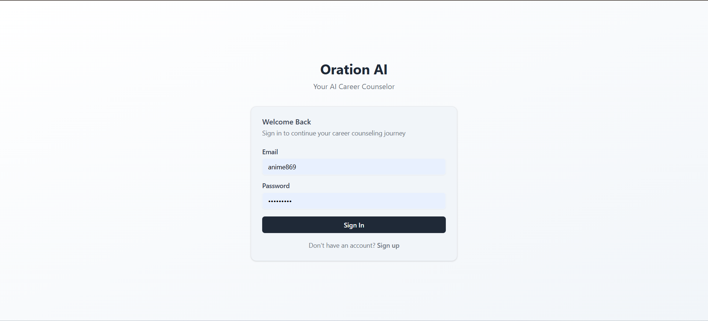
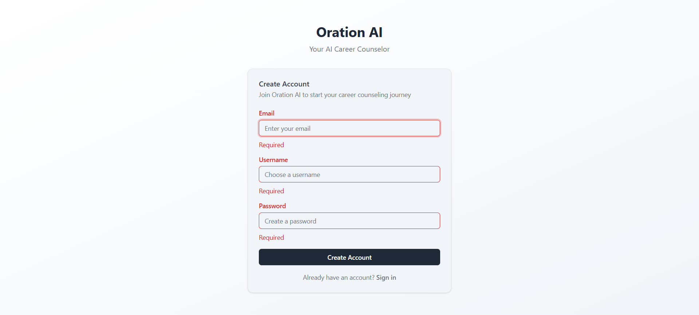
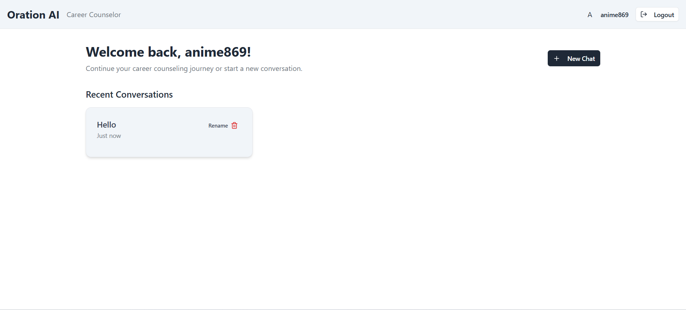
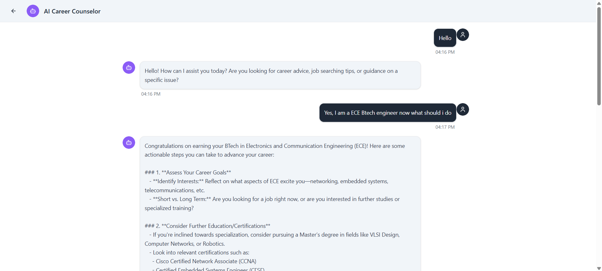

# CHAT-AGENT

*Empowering Conversations, Unlocking Career Success Instantly*

---


---

### Built with the tools and technologies:


A TypeScript-first Next.js app with tRPC, TanStack Query, Prisma, Supabase Auth, and OpenAI integration for a career counseling chat experience.

## Local Setup
1. Install deps
```bash
pnpm install
```

2. Environment variables (`.env.local`)
```bash
# Database
DATABASE_URL=postgres://...        # pooled connection (for app)
DIRECT_URL=postgres://...          # direct connection (for prisma migrate)

# Supabase (Anon key only; do NOT use service key in the app)
NEXT_PUBLIC_SUPABASE_URL=https://<project>.supabase.co
NEXT_PUBLIC_SUPABASE_ANON_KEY=eyJ...

# OpenAI
OPEN_AI_API_KEY=sk-...
```

3. Prisma migrate and generate
```bash
pnpm prisma migrate deploy
pnpm prisma generate
```

4. Dev server
```bash
pnpm dev
```

Open http://localhost:3000.

## Features
- Authenticated app area `(main)` protected by middleware and SSR checks
- Chat sessions: create, list (infinite), rename, delete (with confirmation)
- Messages: persisted per-session, infinite history load in UI
- AI responses via OpenAI using recent conversation context
- Streaming replies (SSE) with live typing indicator
- Optimistic user message and auto-scroll during streaming
- Deep-linkable chats at `/chat/[id]` (refresh keeps you on the same chat)
- Theme toggle (light/dark) persisted in localStorage and respects system preference

## TRPC API
- `session.list` (cursor, limit)
- `session.create`
- `session.rename`
- `session.delete`
- `message.listBySession` (cursor, limit)
- `message.send` (persists user msg, calls OpenAI, persists assistant msg; auto-titles session if needed)

## Streaming (SSE)
- Endpoint: `POST /api/chat/message/stream`
- Body: `{ sessionId: string, content: string }`
- Server streams `data: { type: "delta", content }` events, followed by `data: { type: "done", id }` when complete
- UI consumes the stream and shows a live-updating assistant bubble; on completion it refetches persisted messages

Note: SSE is used instead of WebSocket subscriptions for compatibility with Vercel serverless runtime.

## Deployment (Vercel)
- Set the same env vars in Vercel project settings
- Point `DATABASE_URL` to production DB (Supabase/Neon) and set `DIRECT_URL`
- Run Prisma migrations (via deploy hook or CLI) before first boot
- Redeploy after any schema changes

### Middleware placement
Ensure auth middleware runs on Vercel by adding a root `middleware.ts` that re-exports the Supabase middleware:

```ts
// middleware.ts
export { middleware, config } from "@/utils/supabase/middleware";
```

## Notes on Supabase + Prisma
- Supabase manages `auth.users`. Prisma should not migrate or create it.
- Ensure your Prisma schema references `auth.users(id)` via foreign keys.
- Use `DIRECT_URL` for running migrations (non-pooled) and `DATABASE_URL` for app runtime (pooled).

If you map `User` to `auth.users` in Prisma, prefer schema-aware mapping and do not attempt to upsert into `auth.users` from the app:

```prisma
model User {
  id        String   @id @default(uuid()) @db.Uuid
  email     String?  @db.VarChar
  createdAt DateTime @default(now()) @map("created_at")

  profile   Profile?
  sessions  ChatSession[]
  messages  ChatMessage[]

  @@map("users")
  @@schema("auth")
}
```

The app relies on Supabase Auth to create users; do not upsert `User` rows.

## Roadmap / Improvements
- Streaming AI responses
- Typing & delivery indicators
- Theme toggle
- Better error boundaries and retries

## Screenshots




